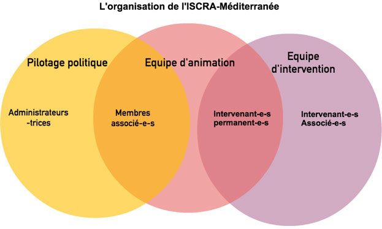

A l'ISCRA, chacun-e, de sa place, entend contribuer à faire le lien entre la production de savoirs académiques et  l’intervention de terrain, et ambitionne par une posture à la fois critique et distanciée de contribuer à la transformation de la cité.  La configuration du projet de l’ISCRA-Méditerranée évolue régulièrement au niveau de ses orientations problématiques, des personnes qui le composent, aussi nous indiquerons à chaque fois les personnes qui ont d’une façon ou d’une autre, à un moment ou à un autre, contribué à son histoire.

l'ISCRA est struturée par l'activité :
- des intervenants-permanents, leurs travaux, leurs publications, leurs postures professionnelles, leurs choix méthodologiques et leurs préoccupations problématiques ; 
- des intervenants-associés, avec lesquels sont conduits, de façon régulière, des projets en coopération ; 
- des membres-associés qui contribuent activement au projet d'intellectualité critique, singulier, porté par l’ISCRA-Méditerranée, parfois par un appui ponctuel aux intervenants permanents, toujours par un compagnonnage inscrit dans la durée : l’animation de travaux de réflexion en interne (ateliers des savoirs impliqués), la définition des orientations problématiques de l’institut et enfin l’organisation d’évènements collectifs (séminaires internes,  publications collectives, univers-cité des savoirs impliquées) ; 
- des administrateurs qui sont garants du projet politique de l’ISCRA-Méditerranée et de son organisation économique. 

 {.img-center}

