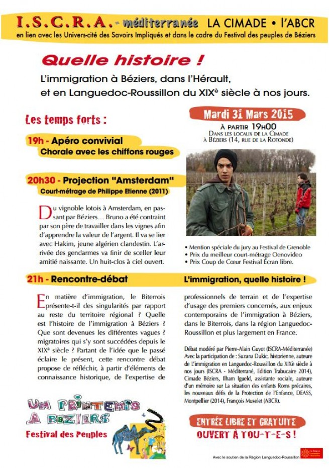

Une série de rencontres publiques en 2015 et 2016

Dans le cadre de la parution du livre sur l'histoire de l'immigration en Languedoc-Roussillon, plusieurs conférences-débats ont été organisés en région par des associations :

Deux siècles d'immigration en Languedoc-Roussillon, à Vendres dans le cadre du festival Diversival

Quelle histoire de l'immigration ? dans la salle du Capitole (place de la Mairie à Alès) par l'association RAIA.

le 31 mars 2015, à la Cimade à Béziers  

Au programme :
20h30 Projection du court-métrage AMSTERDAM de Philippe Etienne  
[plugin:vimeo](https://vimeo.com/107800514)  
21h Forum Social animé par l’ISCRA, autour du livre de Suzana Dukic, L’immigration en Languedoc-Roussillon du XIXème siècle à nos jours, avec des intervenants de la CIMADE et de l’ABCR [http://www.politique-actu.com/CIMADE-ISCRA-ABCR](http://www.politique-actu.com/CIMADE-ISCRA-ABCR)  
